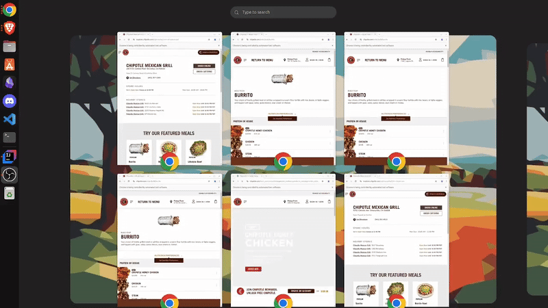

# I eat way too much Chipotle

So I was very disappointed when I found out my chipotle order costs $2 more in Maryland than Pa.
\
As a way to retaliate to voice my disappointment I made this 

## Multithreaded Chipotle Menu Scraper

## How it works
* Main thread creates of listed Chipotle locations
\
(currently uses addresslinks.txt but the code to scrape for locations is in main)
* Spawns N scraper threads who each pull from the top of the queue
* Threads pass store menus and prices to a writer service via a pub/sub style blocking queue
* Writer service thread writes to the json file 'output.json'

## Future plans
I'm going to make a simple website for this where I can refresh the data regularly 
\
I mostly just did this for fun and practice multithreading

P.S. Java has surprisingly good multithreading functionality

## TODO
* Update this readme